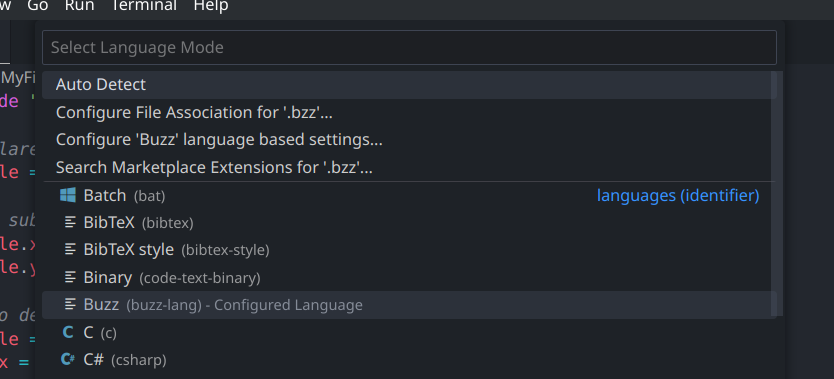
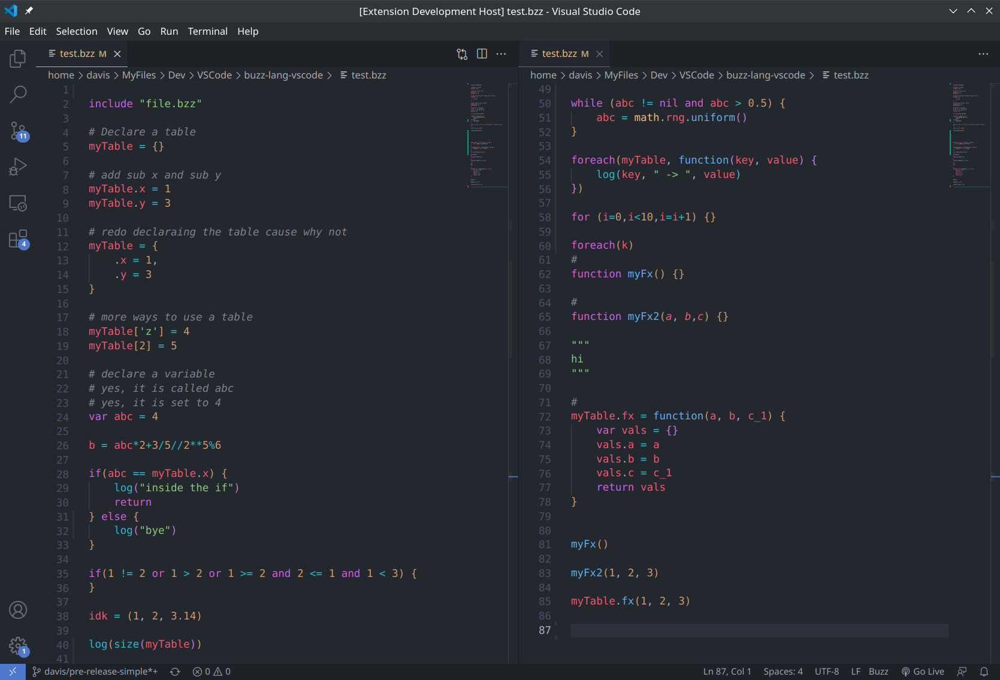

# buzz-lang-syntax README

This extension for VS Code provides syntax highlighting for the Buzz programming language and associated .bzz files. Developed to make it easier to read and write code in Buzz by providing visual cues for language keywords, functions, and other elements. It also enables code navigation, code folding and bracket matching.

## Features

The primary feature of this extension is that it contributes the Buzz programming language, buzz-lang. This provides full syntax highlighting as seen in the images below. This extension associates with .bzz files.

## Known Issues

To be determined.

## Release Notes

### 0.1 (pre-release)

Pre-initial release of the extension

<!-- ### 1.0.0

Initial release of ...

### 1.0.1

Fixed issue #.

### 1.1.0

Added features X, Y, and Z.

--- -->
